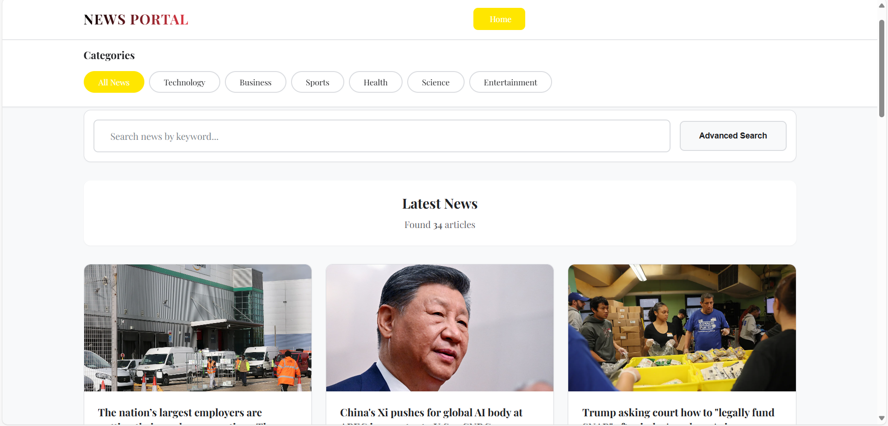
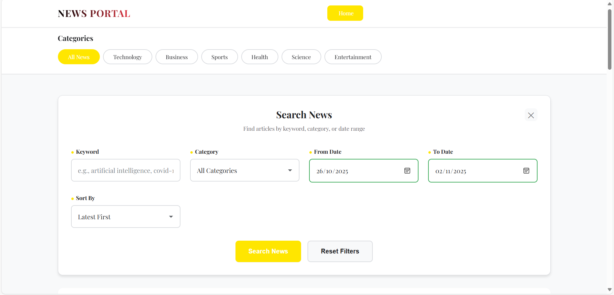
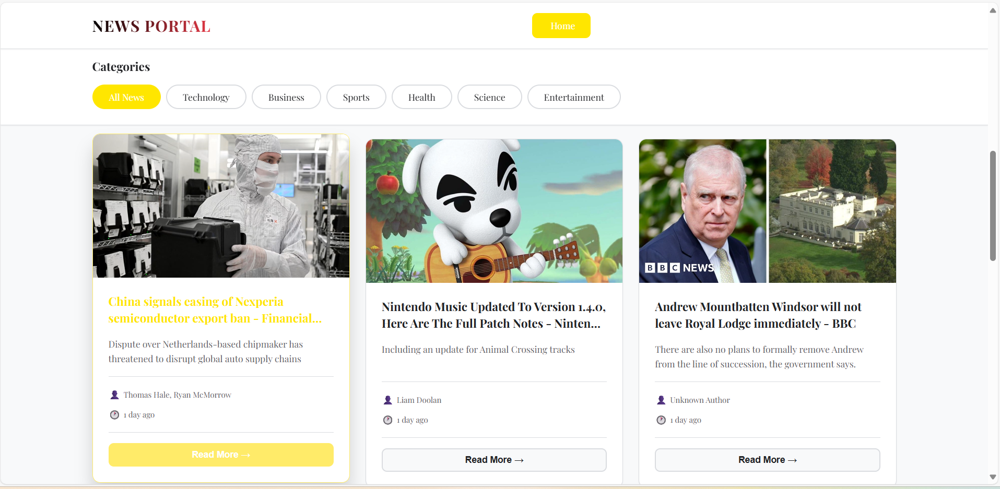
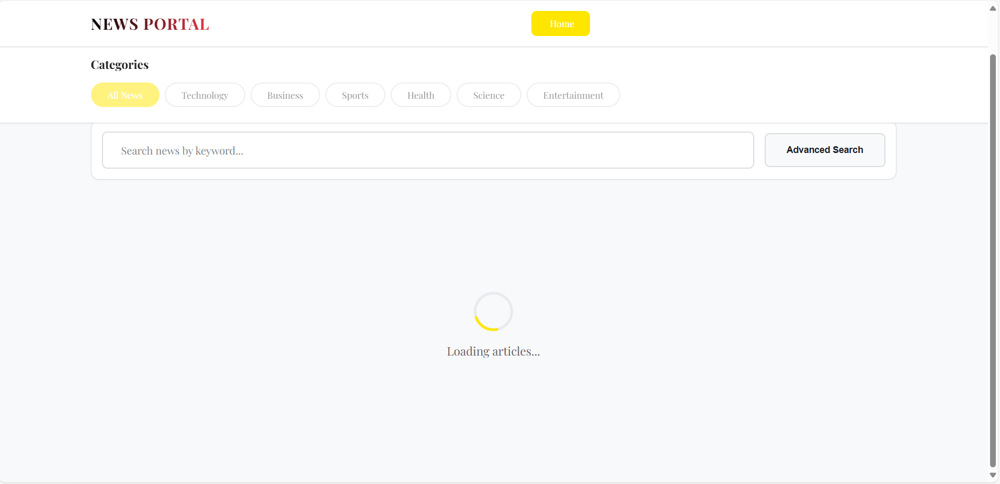
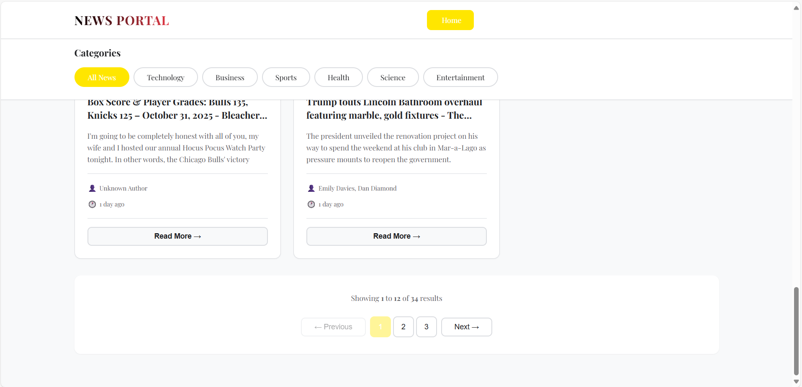

# News Portal - ReactJS Application

## Informasi Mahasiswa
- **Nama**: Aryasatya Widyatna Akbar
- **NIM**: 123140164
- **Mata Kuliah**: Pemrograman Aplikasi Web 
- **Dosen**: Muhammad Habib Algifari

## Deskripsi Projekt
News Portal adalah aplikasi web berbasis ReactJS yang menampilkan berita terkini dari berbagai kategori menggunakan NewsAPI. Aplikasi ini dilengkapi dengan fitur pencarian, filter berdasarkan kategori dan tanggal, serta pagination untuk navigasi artikel yang mudah.

## Fitur Utama
1. **Navigation Bar** - Menu kategori berita dengan font Playfair Display
2. **Expandable Search Form** - Simple search bar yang bisa expand untuk advanced filtering
3. **Category Filter** - Quick filter by category
4. **Date Filter** - Filter artikel berdasarkan rentang tanggal
5. **Pagination** - Navigasi halaman untuk melihat lebih banyak artikel
6. **Responsive Design** - Tampilan optimal di berbagai ukuran layar
7. **Error Boundary** - Comprehensive error handling untuk stabilitas aplikasi
8. **Loading Spinner**: Indikator saat fetching data
9. **Error Handling**: Pesan error yang user-friendly
10. **Empty State**: Tampilan ketika tidak ada hasil
11. **Image Fallback**: Placeholder untuk artikel tanpa gambar
12. **Date Formatting**: Tampilan tanggal yang readable
13. **URL Validation**: Handle artikel dengan URL yang valid

## Teknologi yang Digunakan
- **Framework**: ReactJS 18 
- **Styling**: CSS Murni 
- **HTTP Client**: Fetch API
- **State Management**: React Hooks (useState, useEffect)
- **API**: NewsAPI (https://newsapi.org/)
- **Deployment**: Vercel

## Struktur Folder
```
news-portal/
├── public/
│   ├── index.html
│   ├── manifest.json
│   ├── robots.txt
│   ├── favicon.ico          
│  
├── src/
│   ├── components/
│   │   ├── Header.jsx
│   │   ├── SearchForm.jsx
│   │   ├── CategoryNav.jsx
│   │   ├── ArticleCard.jsx
│   │   ├── ArticleList.jsx
│   │   ├── Pagination.jsx
│   │   ├── LoadingSpinner.jsx
│   │   ├── DateFilter.jsx
│   │   └── ErrorBoundary.jsx
│   ├── services/
│   │   └── newsApi.js
│   ├── utils/
│   │   └── dateFormatter.js
│   ├── styles/
│   │   ├── App.css
│   │   ├── Header.css
│   │   ├── SearchForm.css
│   │   ├── ArticleCard.css
│   │   ├── responsive.css
│   │   └── ErrorBoundary.css
│   ├── App.jsx
│   └── index.js
├── screenshots/             
├── .env                    
├── .gitignore
├── package.json
├── vercel.json
├── README.md
└── Step-By-Step.md       
```

## Cara Instalasi

### 1. Clone Repository
```bash
git clone [URL_REPOSITORY]
cd news-portal
```

### 2. Install Dependencies
```bash
npm install
```

### 3. Setup Environment Variables
Buat file `.env` di root folder dan tambahkan API key dari NewsAPI:
```
REACT_APP_NEWS_API_KEY=api_key.
```

**Cara mendapatkan API Key:**
1. Kunjungi https://newsapi.org/
2. Klik "Get API Key"
3. Daftar dengan email (gratis)
4. Copy API key yang diberikan

### 4. Run Development Server
```bash
npm start
```
Aplikasi akan berjalan di `http://localhost:3000`

### 5. Build untuk Production
```bash
npm run build
```

## 🌐 Deployment ke Vercel

### Cara Deploy:
1. Push code ke GitHub repository
2. Login ke https://vercel.com
3. Klik "New Project"
4. Import GitHub repository
5. Tambahkan Environment Variable:
   - Key: `REACT_APP_NEWS_API_KEY`
   - Value: [Your API Key]
6. Klik "Deploy"

**Link Deployment**: [URL akan muncul setelah deploy]

## Screenshot Aplikasi

### Halaman Utama

*Tampilan utama: Header,Categories,Search, dan Article*

### Advanced Search 

*Advanced Search: Keyword, Category, Range date, dan Sorting*

### Article Design

*Design Article cardnya*

### Loading Spinner

*Loading Screen halaman web*

### Pagination

*Halaman berikutnya*

## Troubleshooting

### API Key Error
Jika muncul error 401, pastikan:
- File `.env` sudah dibuat di root folder
- API key valid dan aktif
- Restart development server setelah menambah `.env`

### CORS Error
NewsAPI free tier memiliki batasan:
- Hanya bisa akses dari localhost saat development
- Production perlu upgrade atau gunakan proxy

### Rate Limit
Free tier NewsAPI: 100 requests/hari
- Cache hasil di localStorage (optional)
- Gunakan pagination dengan bijak